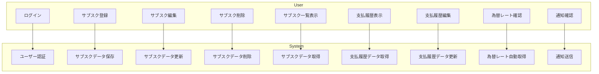

```mermaid
flowchart TD
    subgraph User
        A1[ログイン]
        A2[サブスク登録]
        A3[サブスク編集]
        A4[サブスク削除]
        A5[サブスク一覧表示]
        A6[支払履歴表示]
        A7[支払履歴編集]
        A8[為替レート確認]
        A9[通知確認]
    end

    subgraph System
        B1[ユーザー認証]
        B2[サブスクデータ保存]
        B3[サブスクデータ更新]
        B4[サブスクデータ削除]
        B5[サブスクデータ取得]
        B6[支払履歴データ取得]
        B7[支払履歴データ更新]
        B8[為替レート自動取得]
        B9[通知送信]
    end

    A1 --> B1
    A2 --> B2
    A3 --> B3
    A4 --> B4
    A5 --> B5
    A6 --> B6
    A7 --> B7
    A8 --> B8
    A9 --> B9
```
