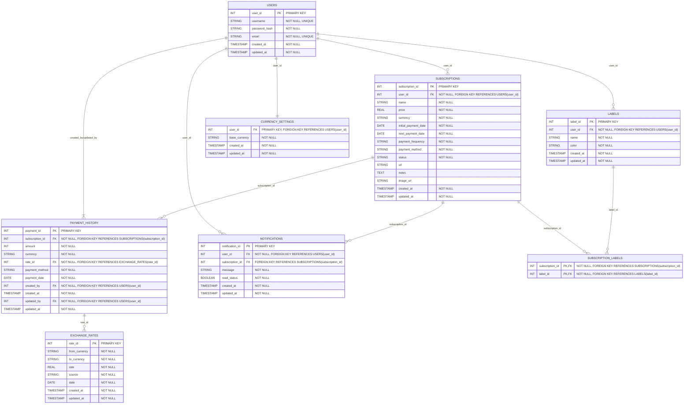

```mermaid
erDiagram
    USERS {
        INT user_id PK "PRIMARY KEY"
        STRING username "NOT NULL, UNIQUE"
        STRING password_hash "NOT NULL"
        STRING email "NOT NULL, UNIQUE"
        TIMESTAMP created_at "NOT NULL"
        TIMESTAMP updated_at "NOT NULL"
    }

    SUBSCRIPTIONS {
        INT subscription_id PK "PRIMARY KEY"
        INT user_id FK "NOT NULL, FOREIGN KEY REFERENCES USERS(user_id)"
        STRING name "NOT NULL"
        REAL price "NOT NULL"
        STRING currency "NOT NULL"
        DATE initial_payment_date "NOT NULL"
        DATE next_payment_date "NOT NULL"
        STRING payment_frequency "NOT NULL"
        STRING payment_method "NOT NULL"
        STRING status "NOT NULL"
        STRING url
        TEXT notes
        STRING image_url
        TIMESTAMP created_at "NOT NULL"
        TIMESTAMP updated_at "NOT NULL"
    }

    PAYMENT_HISTORY {
        INT payment_id PK "PRIMARY KEY"
        INT subscription_id FK "NOT NULL, FOREIGN KEY REFERENCES SUBSCRIPTIONS(subscription_id)"
        INT amount "NOT NULL"
        STRING currency "NOT NULL"
        INT rate_id FK "NOT NULL, FOREIGN KEY REFERENCES EXCHANGE_RATES(rate_id)"
        STRING payment_method "NOT NULL"
        DATE payment_date "NOT NULL"
        INT created_by FK "NOT NULL, FOREIGN KEY REFERENCES USERS(user_id)"
        TIMESTAMP created_at "NOT NULL"
        INT updated_by FK "NOT NULL, FOREIGN KEY REFERENCES USERS(user_id)"
        TIMESTAMP updated_at "NOT NULL"
    }

    EXCHANGE_RATES {
        INT rate_id PK "PRIMARY KEY"
        STRING from_currency "NOT NULL"
        STRING to_currency "NOT NULL"
        REAL rate "NOT NULL"
        STRING source "NOT NULL"
        DATE date "NOT NULL"
        TIMESTAMP created_at "NOT NULL"
        TIMESTAMP updated_at "NOT NULL"
    }

    NOTIFICATIONS {
        INT notification_id PK "PRIMARY KEY"
        INT user_id FK "NOT NULL, FOREIGN KEY REFERENCES USERS(user_id)"
        INT subscription_id FK "FOREIGN KEY REFERENCES SUBSCRIPTIONS(subscription_id)"
        STRING message "NOT NULL"
        BOOLEAN read_status "NOT NULL"
        TIMESTAMP created_at "NOT NULL"
        TIMESTAMP updated_at "NOT NULL"
    }

    LABELS {
        INT label_id PK "PRIMARY KEY"
        INT user_id FK "NOT NULL, FOREIGN KEY REFERENCES USERS(user_id)"
        STRING name "NOT NULL"
        STRING color "NOT NULL"
        TIMESTAMP created_at "NOT NULL"
        TIMESTAMP updated_at "NOT NULL"
    }

    SUBSCRIPTION_LABELS {
        INT subscription_id PK,FK "NOT NULL, FOREIGN KEY REFERENCES SUBSCRIPTIONS(subscription_id)"
        INT label_id PK,FK "NOT NULL, FOREIGN KEY REFERENCES LABELS(label_id)"
    }

    CURRENCY_SETTINGS {
        INT user_id FK "PRIMARY KEY, FOREIGN KEY REFERENCES USERS(user_id)"
        STRING base_currency "NOT NULL"
        TIMESTAMP created_at "NOT NULL"
        TIMESTAMP updated_at "NOT NULL"
    }

    USERS ||--o{ SUBSCRIPTIONS : "user_id"
    USERS ||--o{ NOTIFICATIONS : "user_id"
    USERS ||--o{ LABELS : "user_id"
    USERS ||--|| CURRENCY_SETTINGS : "user_id"
    USERS ||--|{ PAYMENT_HISTORY : "created_by/updated_by"
    SUBSCRIPTIONS ||--o{ PAYMENT_HISTORY : "subscription_id"
    SUBSCRIPTIONS ||--o{ NOTIFICATIONS : "subscription_id"
    SUBSCRIPTIONS ||--o{ SUBSCRIPTION_LABELS : "subscription_id"
    PAYMENT_HISTORY ||--o{ EXCHANGE_RATES : "rate_id"
    LABELS ||--o{ SUBSCRIPTION_LABELS : "label_id"
```