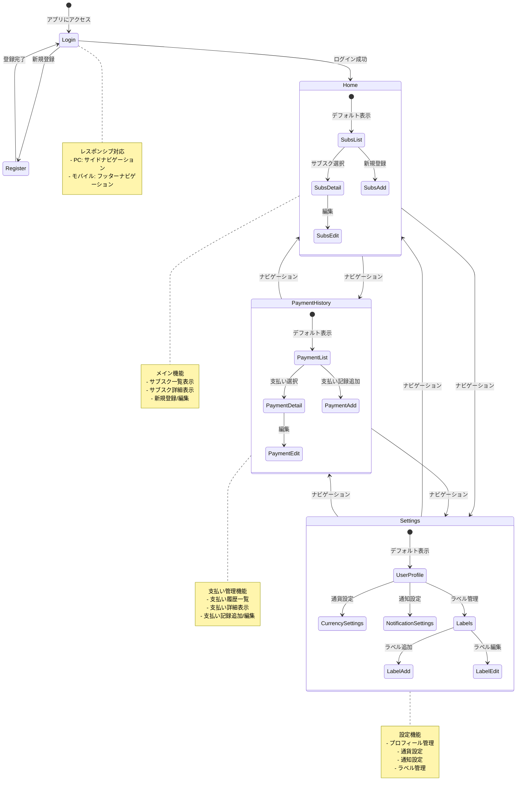

```mermaid
stateDiagram-v2
    [*] --> Login: アプリにアクセス
    Login --> Register: 新規登録
    Register --> Login: 登録完了
    
    Login --> Home: ログイン成功
    
    state Home {
        [*] --> SubsList: デフォルト表示
        SubsList --> SubsDetail: サブスク選択
        SubsList --> SubsAdd: 新規登録
        SubsDetail --> SubsEdit: 編集
    }
    
    state PaymentHistory {
        [*] --> PaymentList: デフォルト表示
        PaymentList --> PaymentDetail: 支払い選択
        PaymentList --> PaymentAdd: 支払い記録追加
        PaymentDetail --> PaymentEdit: 編集
    }
    
    state Settings {
        [*] --> UserProfile: デフォルト表示
        UserProfile --> CurrencySettings: 通貨設定
        UserProfile --> NotificationSettings: 通知設定
        UserProfile --> Labels: ラベル管理
        Labels --> LabelAdd: ラベル追加
        Labels --> LabelEdit: ラベル編集
    }
    
    Home --> PaymentHistory: ナビゲーション
    PaymentHistory --> Home: ナビゲーション
    Home --> Settings: ナビゲーション
    PaymentHistory --> Settings: ナビゲーション
    Settings --> Home: ナビゲーション
    Settings --> PaymentHistory: ナビゲーション
    
    note right of Home
        メイン機能
        - サブスク一覧表示
        - サブスク詳細表示
        - 新規登録/編集
    end note
    
    note right of PaymentHistory
        支払い管理機能
        - 支払い履歴一覧
        - 支払い詳細表示
        - 支払い記録追加/編集
    end note
    
    note right of Settings
        設定機能
        - プロフィール管理
        - 通貨設定
        - 通知設定
        - ラベル管理
    end note

    note right of Login
        レスポンシブ対応
        - PC: サイドナビゲーション
        - モバイル: フッターナビゲーション
    end note
```
